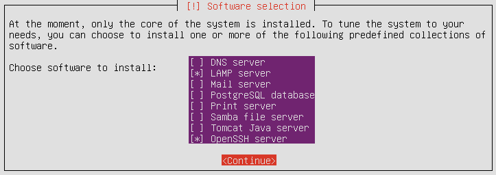

# SPOJ
Simple Programming Contests Online Judge System.

## Installation
Step 1. Download and Install [Ubuntu 17.10.1 Server (32-bit)][1]

Step 2. Enable **LAMP** and **OpenSSH** during installation


Step 3. Log in and execute following lines:
```
git clone https://github.com/dimitarminchev/spoj0.git
cd spoj0
sudo ./spoj0-install.sh
```
Step 4. Enjoy!

## Spoj on Raspberry Pi
- [Donwload Ubuntu for Raspberry Pi][2]
- [Extract image with 7-zip][3]
- [Burn image to SD card with Etcher][4] 

## Ubuntu 16.04 Compilers
- g++ 6.2
- javac 1.8
- Mono C# 4.2

## Credits
- Milo Sredkov, E-mail: <milo@milosredkov.com>
- Dimitar Minchev, E-mail: <dimitar.minchev@gmail.com>, Blog: [minchev.eu][5]
- Ivo Kamenarov, E-mail: <ikk@ami.uni-ruse.bg>

## About
- Original web interface is written on PERL by Milo Sredkov. Online Demo: [dev.bfu.bg][6]. 
- Brand new web interface is written on PHP by Dimitar Minchev. Online Demo: [atp.bfu.bg][7].
- Contestation (Questions and Answers) by Ivo Kamenarov.

[1]: https://www.ubuntu.com/download/alternative-downloads/
[2]: https://wiki.ubuntu.com/ARM/RaspberryPi/
[3]: http://www.7-zip.org/
[4]: http://etcher.io/
[5]: http://www.minchev.eu/
[6]: http://dev.bfu.bg/spoj/
[7]: http://atp.bfu.bg/spoj/
